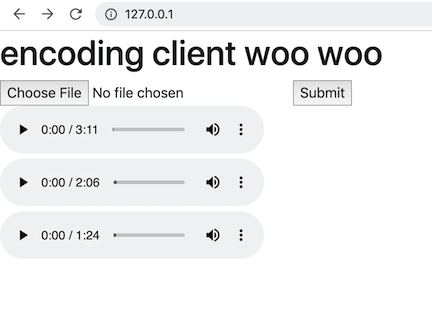

# encoding-server



## what is this?

this is an encoding app which I'm trying to make useful for myself as a musician and audio engineer

the 'car test' is when one listens to a work-in-progress song or piece of audio on a most familiar sound system, often a car.  the familiar setting offers clearer objectivity and potentially, valuable insight.  

i want to build a tool which helps me find clarity in my audio engineering decisions and sparks of joy in the creative process

## cheesy, what IS it though?

it is a fully-containerized, full-stack app backed by mongo and S3

media files can be uploaded to the express server from a react client, where they are encoded to mp3 via ffmpeg and uploaded to s3

records are kept of uploaded files, and uploads are dynamically rendered as audio elements for the client

upload stuff, and listen to it

## run on a mac

requires nodejs/npm and docker on the host

```bash
cd encoding server
npm run startup # if this prompts you to install webpack-cli, say yes and run again
```

check out [http://127.0.0.1:80](http://127.0.0.1:80)

## tech stack


client - React via Webpack and Babel in a NGINX Docker container

server - express and ffmpeg

db - mongo in a docker container

storage - ecrypted in S3 and served via signed requests

```bash
# full stack commands

npm run startup # build and start mongo, nodejs, and nginx containers locally
# NOTE: will prompt you to install webpack-cli. say yes and run again

npm run cleanup # stop local containers

# individual service commands

docker stop nginx # stop client
npm run client # build and serve the client from an NGINX container at localhost:80
npm run client-dev # ^^ but with webpack watching for changes

docker stop mongo # stop db
npm run db # start the mongoDB container, mounts /mongo/data

docker stop nodejs # stop server
npm run server # start nodeJS container at localhost:3000
npm run server-dev # ^^ but with nodemon watching for changes
```
## notes

to use this you will need to create a file: `server/aws.secret.js` with your aws creds.  for example:

```javascript
module.exports = {
  AWS_ACCESS_KEY: 'abcdefghijklmnopqrstuvetc',
  AWS_SECRET_KEY: 'abcdefghijklmnopqrstuvetc',
};
```

bucket settings aren't properly configured yet, but can be detectived in `server/aws/uploadToS3.js`